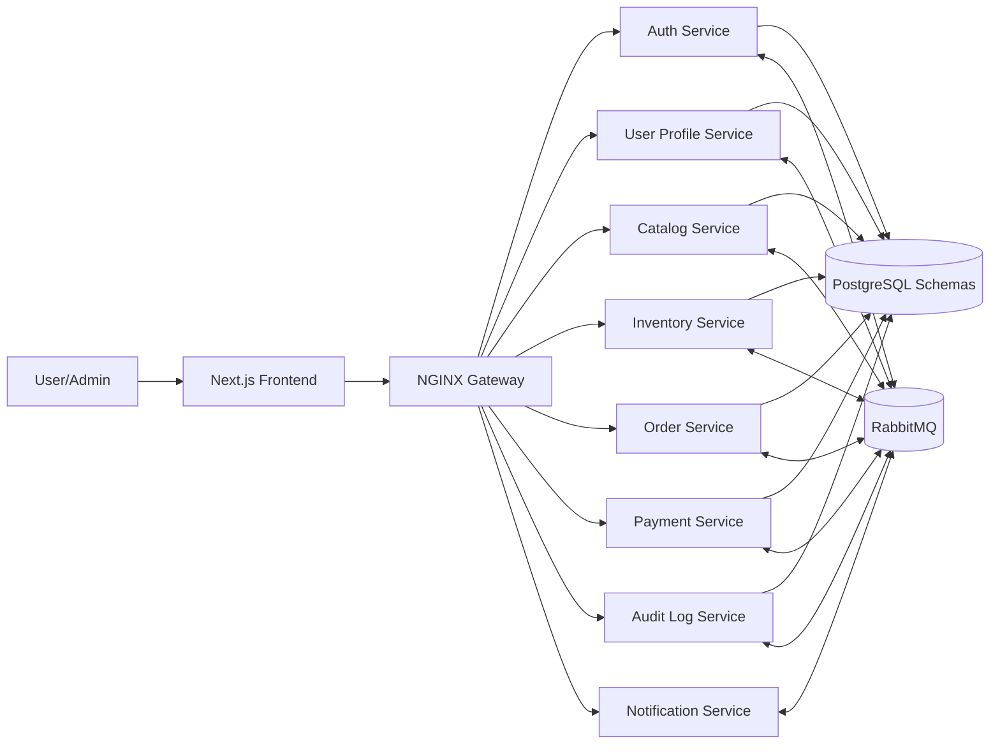

# Tài liệu Phân tích & Thiết kế Hệ thống

## 1. Thông tin tài liệu

- **Tên dự án:** Distributed Art Marketplace - Nền tảng mua bán tranh nghệ thuật Việt Nam.
- **Loại tài liệu:** Phân tích nghiệp vụ + Thiết kế hệ thống (BA + Solution Design).
- **Phạm vi:** Frontend Next.js, API Gateway, 8 microservices backend, PostgreSQL (multi-schema), RabbitMQ, vận hành bằng Docker Compose.
- **Nguồn đầu vào:** `project.md` và các tài liệu `services/*/TASKS.md`.

---

## 2. Bối cảnh & mục tiêu

Hệ thống cần giải quyết bài toán thương mại điện tử chuyên biệt cho tranh nghệ thuật, trong đó các yêu cầu quan trọng là:

- Quản lý danh mục tranh và metadata phong phú (đọc nhiều).
- Quản lý tồn kho chính xác, chống over-sell (ghi nhiều, cạnh tranh cao).
- Xử lý vòng đời đơn hàng theo mô hình sự kiện (event-driven).
- Tách biệt xác thực, hồ sơ người dùng, thanh toán, thông báo và audit để dễ mở rộng.
- Có khả năng truy vết toàn bộ chuỗi hành vi phục vụ vận hành và quản trị.

### 2.1 Mục tiêu kinh doanh

- Tăng khả năng bán tranh online với trải nghiệm tìm kiếm và đặt hàng mượt.
- Giảm rủi ro sai lệch tồn kho và trạng thái đơn hàng.
- Tăng khả năng vận hành, giám sát và điều tra sự cố nhờ audit trail tập trung.

### 2.2 Mục tiêu kỹ thuật

- Kiến trúc phân tán theo microservices, giao tiếp bất đồng bộ qua RabbitMQ.
- Dữ liệu tách schema theo bounded context, giảm coupling dữ liệu trực tiếp.
- Đảm bảo idempotency + retry + DLQ cho các luồng sự kiện quan trọng.

---

## 3. Phạm vi hệ thống

### 3.1 In-scope

- Quản lý tài khoản, đăng nhập, JWT, refresh token.
- Quản lý hồ sơ và địa chỉ giao hàng người dùng.
- Quản lý danh mục tranh, tác giả, danh mục, hình ảnh.
- Quản lý tồn kho và reservation theo đơn hàng.
- Giỏ hàng, tạo đơn, cập nhật trạng thái đơn theo sự kiện.
- Thanh toán qua provider + webhook callback.
- Gửi thông báo email/SMS theo sự kiện nghiệp vụ.
- Ghi log audit tập trung cho Admin.

### 3.2 Out-of-scope (giai đoạn hiện tại)

- Marketplace nhiều người bán với đối soát đa đối tác.
- Quản lý vận chuyển/đơn vị giao hàng chuyên sâu.
- CMS nội dung marketing, loyalty/phần thưởng.
- Tích hợp BI/Data Warehouse nâng cao.

---

## 4. Các bên liên quan & vai trò

- **Khách mua (USER):** xem tranh, đặt hàng, thanh toán, theo dõi đơn.
- **Quản trị viên (ADMIN):** quản trị danh mục, tồn kho, tra cứu audit, test notification.
- **Ops/SRE:** giám sát hệ thống, xử lý sự cố, vận hành message broker.
- **Kế toán/CSKH (gián tiếp):** tra cứu thanh toán, hỗ trợ đơn lỗi, đối soát.

---

## 5. Kiến trúc tổng thể

### 5.1 Thành phần chính

- **Frontend:** Next.js.
- **Gateway:** NGINX (routing, edge concerns).
- **Backend:** 8 Node.js microservices.
- **Database:** PostgreSQL dùng chung instance, tách schema theo service.
- **Message Broker:** RabbitMQ theo mô hình pub/sub.

### 5.2 Danh sách microservices

1. **Auth Service (`auth`):** credential, login, JWT, role cơ bản.
2. **User Profile Service (`users`):** profile, avatar, địa chỉ giao hàng.
3. **Catalog Service (`catalog`):** artists/categories/artworks/images, tìm kiếm, lọc.
4. **Inventory Service (`inventory`):** stocks, reservations, reserve/release/sold.
5. **Order Service (`orders`):** cart, order, state machine đơn hàng.
6. **Payment Service (`payments`):** giao dịch thanh toán, webhook provider.
7. **Notification Service (không DB bắt buộc):** gửi email/SMS theo event.
8. **Audit Log Service (`audit_logs`):** lưu toàn bộ event cho truy vết admin.

### 5.3 Sơ đồ kiến trúc logic (mức cao)



---

## 6. Phân tích nghiệp vụ (Business Analysis)

### 6.1 Use case cốt lõi

- Đăng ký/đăng nhập người dùng.
- Quản lý hồ sơ và địa chỉ giao hàng.
- Duyệt và tìm kiếm tranh.
- Quản lý giỏ hàng và tạo đơn.
- Thanh toán và cập nhật trạng thái đơn.
- Gửi thông báo theo sự kiện.
- Tra cứu audit cho vận hành/admin.

### 6.2 Luồng nghiệp vụ trọng yếu: Đặt hàng end-to-end

1. User tạo đơn từ giỏ hàng tại Order Service (`PENDING`) và phát `order.created`.
2. Inventory Service nhận event và thực hiện reserve bằng transaction + lock.
3. Nếu đủ hàng, phát `inventory.reserved`; nếu thiếu, phát `inventory.failed`.
4. Order Service chuyển trạng thái đơn tương ứng (`AWAITING_PAYMENT` hoặc `FAILED_OUT_OF_STOCK`).
5. Payment Service xử lý giao dịch; khi thành công phát `payment.success`, thất bại phát `payment.failed`.
6. Order Service cập nhật trạng thái cuối (`COMPLETED`/`PAYMENT_FAILED`) và phát `order.completed` khi thành công.
7. Notification Service gửi email/SMS; Audit Log Service lưu toàn bộ chuỗi event.

### 6.3 Quy tắc nghiệp vụ then chốt

- Một artwork không được bị bán vượt số lượng khả dụng.
- Trạng thái đơn phải tuân thủ state machine, không nhảy trạng thái trái quy tắc.
- Mỗi event phải có `eventId` để xử lý idempotent.
- Webhook thanh toán phải xác thực chữ ký trước khi cập nhật trạng thái.
- Dữ liệu profile của user A không được user B chỉnh sửa.

---

## 7. Yêu cầu chức năng (Functional Requirements)

### 7.1 Nhóm xác thực & phân quyền

- Đăng ký, đăng nhập, refresh token, logout, lấy thông tin `me`.
- JWT claims gồm `sub`, `email`, `role`.
- Role tối thiểu: `USER`, `ADMIN`.

### 7.2 Nhóm người dùng

- CRUD profile cá nhân.
- CRUD địa chỉ giao hàng, bao gồm logic địa chỉ mặc định.
- Ràng buộc chỉ một địa chỉ mặc định mỗi user.

### 7.3 Nhóm catalog

- Admin CRUD artist/category/artwork/images.
- Public API listing, filter, sort, pagination, search.
- Đồng bộ trạng thái artwork từ inventory/order events.

### 7.4 Nhóm tồn kho

- Admin import/update stock.
- Reserve/release/sold dựa trên event đơn hàng và thanh toán.
- Worker timeout reservation hết hạn và phát `inventory.released`.

### 7.5 Nhóm đơn hàng

- Quản lý giỏ hàng.
- Tạo đơn từ giỏ, hủy đơn theo rule trạng thái.
- Lưu lịch sử chuyển trạng thái.
- Admin query đơn hàng theo bộ lọc.

### 7.6 Nhóm thanh toán

- Khởi tạo giao dịch và payment link/session.
- Theo dõi trạng thái theo `order_id`.
- Nhận webhook callback, map trạng thái provider -> nội bộ.
- Job đối soát giao dịch treo.

### 7.7 Nhóm thông báo

- Consume event nghiệp vụ để gửi email/SMS.
- Retry backoff, dedup tạm thời, DLQ.
- Admin endpoint test kênh thông báo.

### 7.8 Nhóm audit

- Consume event từ toàn hệ thống.
- Lưu event thống nhất, idempotent theo `event_id`.
- API admin tra cứu theo loại event, service, actor, thời gian.

---

## 8. Yêu cầu phi chức năng (NFR)

### 8.1 Hiệu năng

- Catalog API read-heavy cần tối ưu filter/index/cache.
- Luồng reserve tồn kho phải đảm bảo độ trễ thấp và tính nhất quán cao.

### 8.2 Khả dụng & độ tin cậy

- Có retry và DLQ cho publish/consume event.
- Sử dụng outbox pattern tại các service nghiệp vụ chính (Order, Inventory).
- Xử lý idempotent khi nhận sự kiện trùng lặp.

### 8.3 Bảo mật

- JWT và kiểm tra role tại gateway/service.
- Webhook signature verification.
- Mask thông tin nhạy cảm trong log (token/secret).
- Giới hạn dữ liệu PII trong audit payload.

### 8.4 Quan sát vận hành (Observability)

- Structured logging + correlation/request trace id xuyên service.
- Metrics tối thiểu: latency, error rate, throughput, DLQ count.
- Runbook cho các lỗi chính: pending order, provider down, consume fail.

### 8.5 Bảo trì & mở rộng

- Tách service theo bounded context rõ ràng.
- Contract sự kiện chuẩn hóa để tích hợp service mới.
- Monorepo giúp thống nhất convention và CI/CD.

---

## 9. Thiết kế dữ liệu (Data Design)

### 9.1 Nguyên tắc thiết kế dữ liệu

- Mỗi service sở hữu schema riêng.
- Không truy cập chéo bảng giữa service theo cách đồng bộ trực tiếp.
- Đồng bộ dữ liệu liên miền qua event.

### 9.2 Tóm tắt schema theo service

- `auth`: `users_credentials`, `refresh_tokens`.
- `users`: `profiles`, `addresses`.
- `catalog`: `artists`, `categories`, `artworks`, `artwork_images`.
- `inventory`: `stocks`, `reservations`.
- `orders`: `carts`, `cart_items`, `orders`, `order_items`, `order_status_history`.
- `payments`: `transactions`, `webhook_logs`.
- `audit_logs`: `events`, `processing_errors`.

### 9.3 Ràng buộc dữ liệu quan trọng

- Unique email trong `auth.users_credentials`.
- Unique (`order_id`, `artwork_id`) trong `inventory.reservations`.
- Unique `order_id` trong `payments.transactions`.
- Unique `event_id` trong `audit_logs.events`.
- Rule 1 địa chỉ mặc định/user trong `users.addresses`.

---

## 10. Thiết kế tích hợp sự kiện (Event Design)

### 10.1 Event envelope chuẩn

```json
{
  "eventId": "uuid",
  "eventType": "order.created",
  "occurredAt": "2026-03-24T10:15:30Z",
  "source": "order-service",
  "payload": {}
}
```

### 10.2 Danh mục event chính

- `user.registered`, `user.login_succeeded`
- `profile.updated`, `address.updated`
- `catalog.artwork_created`, `catalog.artwork_updated`, `catalog.artwork_status_changed`
- `order.created`, `order.completed`, `order.cancelled`
- `inventory.reserved`, `inventory.failed`, `inventory.released`
- `payment.success`, `payment.failed`

### 10.3 Ma trận publish/consume (rút gọn)

| Event                | Publisher | Consumers chính                       |
| -------------------- | --------- | ------------------------------------- |
| `user.registered`    | Auth      | User Profile, Audit                   |
| `order.created`      | Order     | Inventory, Audit                      |
| `inventory.reserved` | Inventory | Order, Catalog, Audit                 |
| `inventory.failed`   | Inventory | Order, Audit                          |
| `payment.success`    | Payment   | Order, Inventory, Audit               |
| `payment.failed`     | Payment   | Order, Inventory, Notification, Audit |
| `order.completed`    | Order     | Notification, Catalog, Audit          |

### 10.4 Chiến lược nhất quán dữ liệu

- **Local transaction + outbox** để đảm bảo “ghi DB và phát event” không lệch nhau.
- **Idempotent consumer** dựa vào `eventId`.
- **Retry + DLQ** cho lỗi tạm thời/không thể xử lý.
- **Compensation flow** qua event khi thanh toán thất bại hoặc timeout reservation.

---

## 11. Thiết kế API mức khái niệm

### 11.1 Public APIs (tiêu biểu)

- Auth: `POST /auth/register`, `POST /auth/login`, `POST /auth/refresh`, `POST /auth/logout`, `GET /auth/me`.
- Profile: `GET/PUT /profiles/me`, `PUT /profiles/me/avatar`.
- Address: `GET/POST /profiles/me/addresses`, `PUT/DELETE /profiles/me/addresses/:id`, `PATCH /profiles/me/addresses/:id/default`.
- Catalog: `GET /artworks`, `GET /artworks/:slug`, `GET /artists`, `GET /categories`.
- Cart/Order: `GET /cart`, `POST /cart/items`, `POST /orders`, `GET /orders`, `GET /orders/:orderId`, `POST /orders/:orderId/cancel`.
- Payment: `POST /payments/initiate`, `GET /payments/:orderId/status`, `POST /payments/webhook`.

### 11.2 Admin APIs (tiêu biểu)

- Catalog admin: `/admin/artists`, `/admin/categories`, `/admin/artworks`.
- Inventory admin: `/admin/stocks`, `/admin/stocks/import`.
- Order admin: `/admin/orders`.
- Notification admin: `/admin/notifications/test-email`, `/admin/notifications/test-sms`.
- Audit admin: `/admin/audit-logs`, `/admin/audit-logs/:id`.

---

## 12. State machine đơn hàng & thanh toán

### 12.1 Trạng thái đề xuất đơn hàng

- `PENDING` -> `AWAITING_PAYMENT` -> `COMPLETED`
- Nhánh lỗi: `FAILED_OUT_OF_STOCK`, `PAYMENT_FAILED`, `CANCELLED`

### 12.2 Quy tắc chuyển trạng thái chính

- `PENDING` + `inventory.reserved` => `AWAITING_PAYMENT`
- `PENDING` + `inventory.failed` => `FAILED_OUT_OF_STOCK`
- `AWAITING_PAYMENT` + `payment.success` => `COMPLETED`
- `AWAITING_PAYMENT` + `payment.failed` => `PAYMENT_FAILED`
- `PENDING` hoặc `AWAITING_PAYMENT` + user cancel hợp lệ => `CANCELLED`

---

## 13. Thiết kế bảo mật

- JWT access token + refresh token rotation.
- Phân quyền role-based cho toàn bộ endpoint `/admin/*`.
- Bảo vệ webhook bằng chữ ký + kiểm tra replay/duplicate.
- CORS/security headers theo policy hệ thống.
- Chuẩn response lỗi thống nhất: `code`, `message`, `details`.

---

## 14. Thiết kế vận hành & giám sát

### 14.1 Logging

- Áp dụng correlation id xuyên request và event.
- Log theo cấu trúc JSON, không ghi lộ bí mật.

### 14.2 Metrics gợi ý

- API: request count, p95 latency, error rate.
- Inventory: reserve success rate, stock conflict rate.
- Payment: payment success rate, callback latency, pending aging.
- Messaging: consumer lag, retry count, DLQ count.

### 14.3 Cảnh báo vận hành

- Tăng bất thường `payment.failed`.
- DLQ tăng theo chuỗi.
- Order treo `PENDING`/`AWAITING_PAYMENT` vượt ngưỡng thời gian.

---

## 15. Kiểm thử & đảm bảo chất lượng

### 15.1 Chiến lược test

- Unit test cho logic lõi từng service.
- Integration test cho API và luồng event liên service.
- Test idempotency khi event duplicate.
- Test concurrency cho inventory để chứng minh không over-sell.

### 15.2 Tiêu chí chấp nhận tổng thể

- Luồng cart -> order -> reserve -> payment -> complete chạy ổn định.
- Không có transition trạng thái sai luật.
- Webhook an toàn và idempotent.
- Audit ghi đủ event chính, tra cứu được qua admin API.

---

## 16. Rủi ro kiến trúc & phương án giảm thiểu

- **Rủi ro eventual consistency:** trạng thái tạm lệch giữa service.
  - **Giảm thiểu:** outbox, retry, idempotency, dashboard reconciliation.
- **Rủi ro duplicate event/webhook:** xử lý lặp dẫn tới sai dữ liệu.
  - **Giảm thiểu:** unique key/eventId, trạng thái bất biến theo rule.
- **Rủi ro quá tải broker hoặc provider bên thứ ba:** chậm xử lý.
  - **Giảm thiểu:** backpressure, timeout, circuit breaker, DLQ.
- **Rủi ro lộ dữ liệu nhạy cảm:** log/audit chứa thông tin quá mức.
  - **Giảm thiểu:** masking, phân loại dữ liệu, retention policy.

---

## 17. Khoảng trống yêu cầu cần chốt thêm

- SLA/SLO định lượng cho từng endpoint quan trọng.
- Chính sách retention chính thức cho audit logs (12 hay 24 tháng).
- Danh sách payment provider mục tiêu và quy tắc đối soát chuẩn.
- Quy tắc hủy đơn chi tiết theo từng trạng thái và mốc thời gian.
- Chính sách bảo mật dữ liệu cá nhân và tuân thủ pháp lý áp dụng.

---

## 18. Lộ trình triển khai đề xuất (MVP -> mở rộng)

### Giai đoạn 1 (MVP)

- Auth, User Profile, Catalog, Inventory, Order, Payment (flow cơ bản), Audit.
- Event chuẩn hóa + idempotency + retry cơ bản.

### Giai đoạn 2

- Notification đa kênh hoàn chỉnh, template hóa sâu.
- Tối ưu cache/search cho catalog read-heavy.
- Dashboard vận hành và cảnh báo tự động.

### Giai đoạn 3

- Reconciliation tự động nâng cao.
- Mở rộng theo phân khúc seller/đối tác (nếu bài toán kinh doanh yêu cầu).

---

## 19. Kết luận

Thiết kế hiện tại phù hợp cho bài toán thương mại điện tử nghệ thuật có yêu cầu tách miền nghiệp vụ rõ, đảm bảo mở rộng và vận hành tốt trong môi trường phân tán. Trọng tâm kỹ thuật cần được thực thi nghiêm ngặt là: **tính nhất quán eventual consistency**, **idempotency xuyên event/webhook**, **state machine đơn hàng**, và **khả năng quan sát vận hành theo chuỗi sự kiện**. Khi hoàn thiện các khoảng trống yêu cầu định lượng (SLA, retention, compliance), hệ thống có thể triển khai theo hướng production-ready với rủi ro kiểm soát được.
